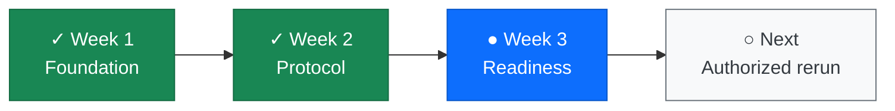
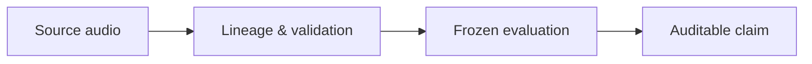

# AudiobookBench-CN

**A research benchmark for temporal security, forensics, and responsible
evaluation of long-form generative speech.**

AudiobookBench-CN studies whether reliability and security failures that emerge
over time in long-form text-to-speech can be measured, localized, and evaluated
under a frozen, auditable protocol.

## Project status

| Item | Current state |
|---|---|
| Engineering foundation | **Week 1–2 complete** |
| Current milestone | **Week 3 — F5 Stage-A clean-rerun readiness** |
| Clean-rerun engineering controls | **Ready** |
| Active formal execution authorization | **Absent** |
| Formal F5 generation / scientific metrics | **Not run** |



The current milestone is implementation readiness, **not scientific closure**.
The earlier Week 3 execution is forensic-only; any future clean rerun must use
the frozen protocol and a separately validated active authorization. See
[the readiness record](research_assurance/WEEK3_CLEAN_RERUN_READINESS.md) and
[the scientific-integrity adjudication](research_assurance/WEEK3_CLEAN_RERUN_SCIENTIFIC_INTEGRITY_ADJUDICATION.md).

## What is in this repository?

| Area | Contents |
|---|---|
| `src/audiobookbench/` | Data preparation, temporal features, security controls, evaluators, and statistics |
| `experiments/` | Reproducible entry points for the research workflow |
| `configs/` | Versioned protocols, schemas, and frozen experiment configurations |
| `tests/` | Unit, security-contract, and orchestration tests |
| `research_assurance/` | Audits, claim boundaries, integrity decisions, and protocol evidence |
| `docs/` | Research plans and project documentation |
| `data/manifests/` | Public schema examples only — not experimental source data |

## How the evaluation is designed



Each scientific claim is gated by provenance, validator, and accounting checks.
Synthetic fixtures are used only for software tests and never as formal
research evidence.

## Quick start

```bash
git clone https://github.com/XuWenboooo/AudiobookBench-CN.git
cd AudiobookBench-CN
python -m venv .venv
.\.venv\Scripts\Activate.ps1      # Windows PowerShell
pip install -e .
pip install -r requirements.txt
pytest tests/test_manifest.py tests/test_portability.py -q
```

To use real data or model assets, obtain them directly from their original
licensors, configure paths for your own environment, and read the relevant
protocol and assurance documents before running a workflow.

## Reproducibility and data policy

- Audio, source datasets, generated results, model checkpoints, and local
  environments are deliberately excluded from this public release.
- Third-party model repositories are not bundled; obtain them independently
  and comply with their respective licenses.
- Some historical frozen records retain original local paths so their recorded
  hashes remain auditable. They are not portable runtime settings.
- The repository is released under the [MIT License](LICENSE).

## Citation and contact

This is an active research repository. Please cite the repository URL and the
specific protocol or assurance record used in your work. A formal citation
record will be added when the benchmark reaches scientific closure.
